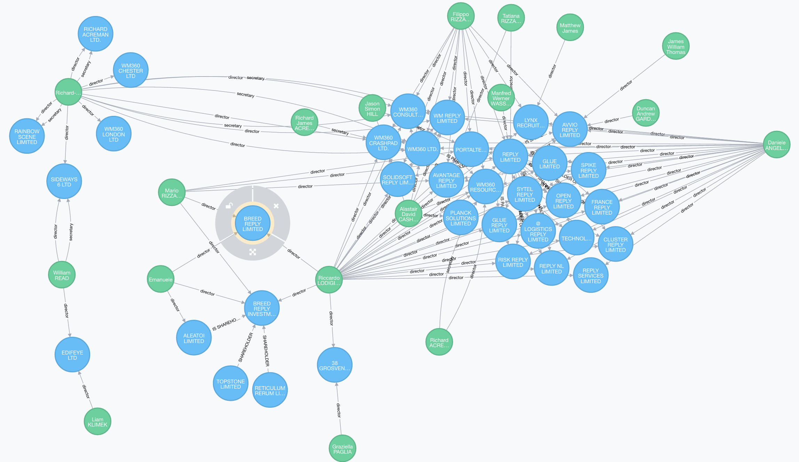

# Company Neighbourhood Instantiator
The purpose of this package is to collect data specific to a company as well as to the <b>direct (n-hop)</b> network of that company and import that data into Neo4j for inspection. The relationships identified between two companies are based on intermediate links between officers participating in both. Officers may participate in companies with different roles. These roles are captured to characterise the different kinds of relationships.

The code is executed in an iterative fashion relying on a [Breadth First Search (BFS)](https://en.wikipedia.org/wiki/Breadth-first_search) approach and stops either if no more neighbours can be found or if the maximum n-hops distance from the root company has been covered (e.g. 10 hops).

By leveraging this code we were able to construct the Reply Ltd company neighbourhood illustrated in the below picture.



The rest of this README file covers:

Installation and running instructions;
Code Documentation;
TODO: Gaps to be addressed,and;
Credits;

## Installation & Running
If you are using pyCharm then almost all packages necessary for running this code will be automatically installed. To run the package you need to first have a live Neo4j session running on your machine. Make sure that the Neo4j instance is running on <b>localhost</b> and that the access credentials are correct. These are found in [module_neo4j.py](./module_neo4j.py) in line: 7:
```python
graph = Graph('localhost', user='neo4j', password='neo4j1')
```
Finally, to use the [CompanyHouse API](https://developer.companieshouse.gov.uk/api/docs/index.html) you will need to generate access credentials. These are generally composed of a username and password but in this case one only needs a username. Specifically, though this is not listed in the CompanyHouse documentation, requests made using the Python ```requests``` library cannot omit the the password section but need to replace it with an empty character as shown below:

```python
username = 'xxxxxxxxxxxxxxxxxxxxxxxxxxxxxxxxxxxxxxxx'
password = ''
response = requests.get(url=call, auth=HTTPBasicAuth(username, password))
```

## Code Documentation: The Package Modules & How they are used

### init.py
The <b>main</b> part of the code which takes as input a company's unique identifier and starts building its <b>neighbourhood network</b>.The network is built using a <b>Breadth First Search (BFS)</b> approach. The process goes through the following steps:

1.  Get the information for a company A.
2.  Create a <b>company node</b> for that company.
3.  Get all the <b>officers</b> associated with company A.
4.  For each <b>officer</b> get the list of companies they currently
have <b>active roles</b> at. Lets call this set of companies N.
5.  Create a company's <b>1-hop neighbourhood</b> by concatenating all
Ns collected for each officer in company A, having filtered out
duplicates as well as company A itself if found. Lets call this set: M
6.  For every company in M repeat steps 1 to 6.
7.  End data collection if:
  1.  Maximum number of hops has been reached.
  2.  No more new neighbouring companies can be found.

<b>Note:</b> A 1-hop is considered to be the distance between a <b>company A</b> and a neighbouring company B (i.e. companies A and B
share the same director).

### module_company.py
The <b>company module</b> is where the company profile is saved. The file also includes a routine for collecting a company's active officers.

### module_officer.py
The <b>officer module</b> is where the company profile is saved. The file also includes a routine for collecting an officer's active participation in other companies.

### module_neo4j.py
The <b>neo4j module</b> responsible for instantiating nodes and relationships between them as well as loading everything into <b>Neo4j</b>. It’s worth noting that the first time this code is run you will need to uncomment the code under ```CREATE UNIQUENESS CONSTRAINTS``` which needs to only run once but should not be run every other time the code is executed.

```python
graph.schema.create_uniqueness_constraint("Officer", "id")
graph.schema.create_uniqueness_constraint('Company', 'id')
```

This is a py2neo driver issue that hasn’t been addressed yet and thus needs to be dealt with manually.

## TODO: Gaps to be addressed

<b>TODO 1:</b> The main problem that needs to be addressed (and which is already partly addressed in the code) is that of duplicate entries on the company house database. It seems like a single officer with multiple placements might appear in the database with many unique ids but be the same person. In addition, some directors register themselves with what maybe minor typos in their names or purposely added hyphens etc.

This makes it even more difficult to link people based on having the same name.

At the time of writing (11/08/2016), we instantiate distinct nodes for different names (i.e. we do merge nodes with <b>just</b> the same name, since in a small network of companies it is highly unlikely that two entities with the same name will concern distinct people) and will resort to manually merging nodes if necessary for client presentations, since the neighbourhood graph is not that big.

<b>PROPOSITION:</b> I think that it is worth investing some time in the future to produce some rules for fuzzy joining these nodes - we will have to face this problem eventually anyway.

<b>TODO 2:</b> Add a automatically delete known_hosts file from `/user/.neo4j/known_hosts` for first link between py2neo & neo4j.

## Contributing

1. Fork it!
2. Create your feature branch: `git checkout -b my-new-feature`
3. Commit your changes: `git commit -am 'Add some feature'`
4. Push to the branch: `git push origin my-new-feature`
5. Submit a pull request :D

## License

(c) Copyright 2016 Data Reply UK, all rights reserved.
